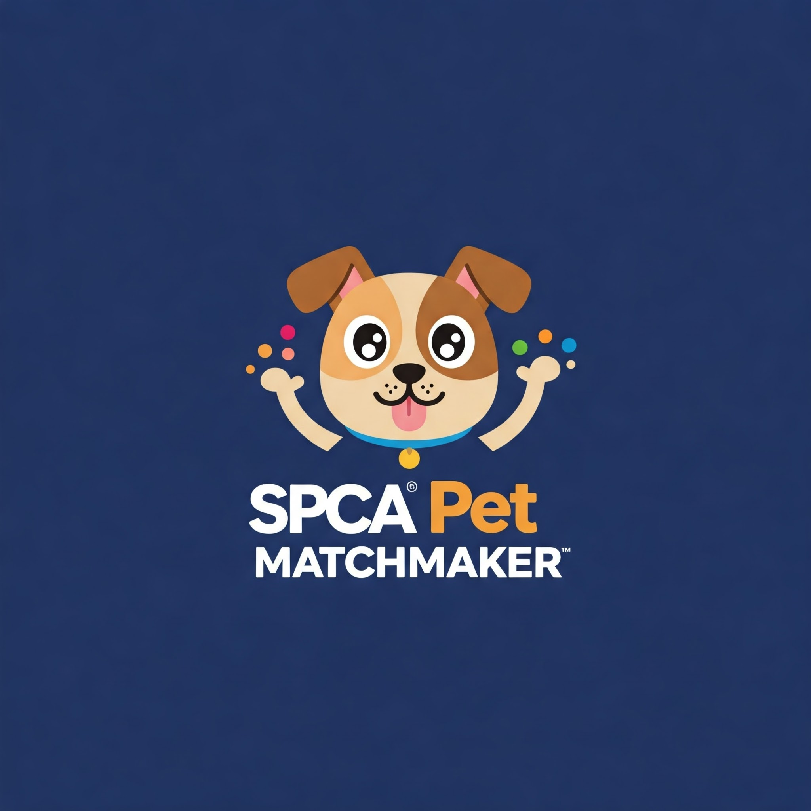

# Final Project: SPCA Pet Matchmaker

Final Project for University of London B.Sc. Computer Science (CM3070)

This project implements an end to end pet matchmaker for all the SPCAs in South Africa which publish pets which are up for adoption on their websites.

The overall architecture is as follows:
- scrapers using selenium and beautiful soup
- postgres database
- golang REST API
- react.js website frontend

## Dev Sources
1. Base image for scrapers: https://hub.docker.com/r/infologistix/docker-selenium-python
